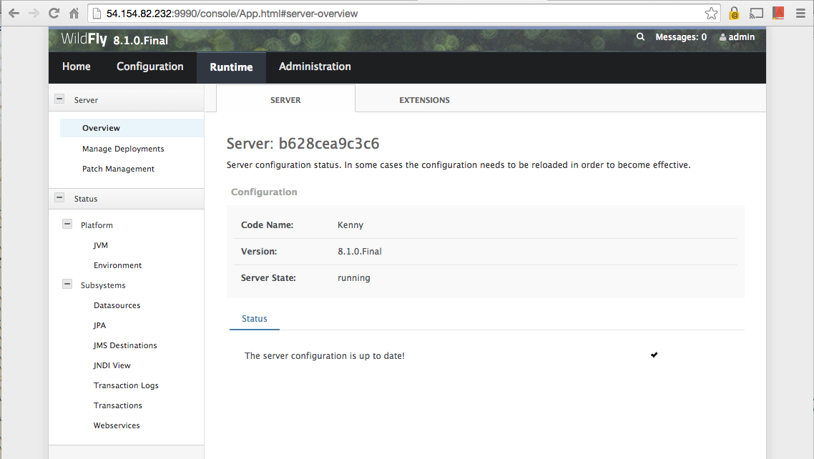
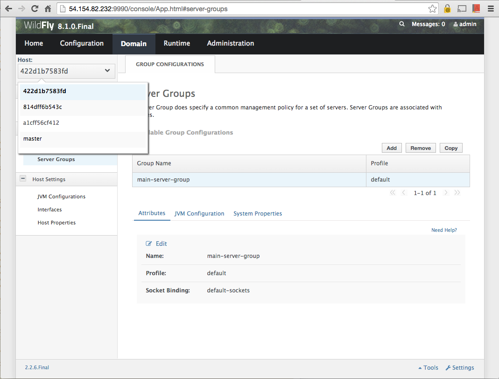

## Docker Integration

This chapter gets you started on WildFly-Camel on [Docker](https://www.docker.com/)  

### Installing Docker

SSH into your instance and type 

```
$ sudo yum install -y docker
$ sudo service docker start
``` 

to install and start Docker.

### Giving non-root access

The docker daemon always runs as the root user, and the docker daemon binds to a Unix socket instead of a TCP port. By default that Unix socket is owned by the user root, and so, by default, you can access it with sudo.

If you have a Unix group called `docker` and add users to it, then the docker daemon will make the ownership of the Unix socket read/writable by the `docker` group when the daemon starts. The docker daemon must always run as the root user, but if you run the docker client as a user in the `docker` group then you don't need to add sudo to all the client commands.

```
$ sudo usermod -a -G docker ec2-user
$ sudo service docker restart
``` 

> <small>You may have to logout/login for this change to take effect</small>

In my case I also had to add a host mapping like this

```
[ec2-user@ip-172-30-0-233 ~]$ sudo cat /etc/hosts
127.0.0.1       localhost localhost.localdomain
172.30.0.233	ip-172-30-0-233
```

and make the docker daemon bind to a number of sockets

```
[ec2-user@ip-172-30-0-217 ~]$ cat /etc/sysconfig/docker
# Additional startup options for the Docker daemon
OPTIONS="-H tcp://127.0.0.1:2375 -H unix:///var/run/docker.sock"
```

### Standalone Server

With every WildFly-Camel release we also publish the latest [wildflyext/wildfly-camel](https://registry.hub.docker.com/u/wildflyext/wildfly-camel/) image.

You can run the standalone container like this

```
$ docker run --rm -ti -e WILDFLY_MANAGEMENT_USER=admin -e WILDFLY_MANAGEMENT_PASSWORD=admin -p 8080:8080 -p 9990:9990 wildflyext/wildfly-camel
```

and access the admin console like this: http://54.154.82.232:9990/console



The Hawt.io console is available at: http://54.154.82.232:8080/hawtio


### Domain Setup

Running multiple server containers in a cloud environment is often only useful when these containers can also be managed. Without the management interfaces exposed it would be virtually impossible to adjust configurations for these individual servers or the whole set. As a minimum we would like to monitor the health state of these servers so that we can possibly replace containers if needed.

You can run the container that acts as a domain controller like this

```
$ docker run --rm -ti -e WILDFLY_MANAGEMENT_USER=admin -e WILDFLY_MANAGEMENT_PASSWORD=admin -p 9990:9990 --name=domain-master wildflyext/wildfly-camel --domain-config domain-camel.xml --host-config host-master.xml -b 0.0.0.0 -bmanagement 0.0.0.0
```

and various hosts that connect to the domain controller as daemons like this

```
$ docker run -d -e WILDFLY_MANAGEMENT_USER=admin -e WILDFLY_MANAGEMENT_PASSWORD=admin -p 8080 --link domain-master:domain-controller wildflyext/wildfly-camel --domain-config domain-camel.xml --host-config host-camel-slave.xml -b 0.0.0.0 -bmanagement 0.0.0.0
```

As above, you can access the admin console like this: http://54.154.82.232:9990/console



Now we have a domain controller running that is reachable on `9990` and three hosts that expose their respective `8080` port on various public network ports.

```
$ docker ps
CONTAINER ID        IMAGE                             COMMAND                CREATED             STATUS              PORTS                                         NAMES
eac043e97abc        wildflyext/wildfly-camel:latest   "/opt/jboss/wildfly/   4 seconds ago       Up 2 seconds        9990/tcp, 9999/tcp, 0.0.0.0:49158->8080/tcp   desperate_hawking    
27a41d2b8a4e        wildflyext/wildfly-camel:latest   "/opt/jboss/wildfly/   5 seconds ago       Up 4 seconds        9999/tcp, 9990/tcp, 0.0.0.0:49157->8080/tcp   ecstatic_davinci     
6d47cae3be7c        wildflyext/wildfly-camel:latest   "/opt/jboss/wildfly/   6 seconds ago       Up 5 seconds        9999/tcp, 9990/tcp, 0.0.0.0:49156->8080/tcp   determined_mestorf   
6095cf80d3a8        wildflyext/wildfly-camel:latest   "/opt/jboss/wildfly/   15 seconds ago      Up 14 seconds       8080/tcp, 9999/tcp, 0.0.0.0:9990->9990/tcp    domain-master        
```

We retained WildFly manageability in a Docker environment.

The next level up would be a cloud management layer like [Kubernetes](https://github.com/GoogleCloudPlatform/kubernetes/blob/master/README.md) or [OpenShift](https://www.openshift.com/products/origin). 

The goal would be a setup that is highly available (HA) and scalable because containers that go bad can transparently replaced or new ones added. The public facing service should be reachable on a known address and request load should be balanced across the available hosts.  


