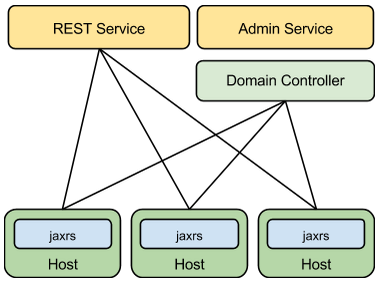

## Domain Setup

In this guide we show how to run a WildFly Camel domain on [OpenShift V3](https://github.com/openshift/origin). The target platform is Linux on an Amazon EC2 instance. When done, we have a set of portable [Docker](https://www.docker.io/) containers that can be deployed onto a production platform.

Running multiple servers in a cloud environment is all the more useful when these servers can also be managed. In the [previous example](openshift-standalone.md) we had three servers that each exposed an HTTP service reachable through a Kubernetes [Service](https://github.com/GoogleCloudPlatform/kubernetes/blob/master/docs/services.md). The management interface of these servers were not exposed. It would be virtually impossible to adjust configurations for these individual servers or the whole set. As a minimum we would like to monitor the health state of these servers so that we can possibly replace containers if needed.



### Starting OpenShift Origin

To start OpenShift Origin as a Docker container run

```
$ docker run --rm -v /var/run/docker.sock:/var/run/docker.sock --net=host --privileged openshift/origin start
```

We may also want to create an alias to the Kubernetes client

```
alias kube="docker run --rm --net=host openshift/origin kube"
```
