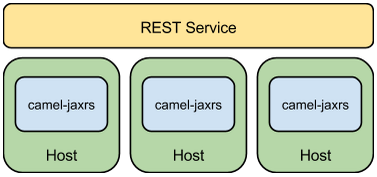

## Introduction

In this guide we show how to run a set of WildFly Camel servers on [OpenShift V3](https://github.com/openshift/origin). Target platforms are iOS and Fedora. When done, we have a set of portable [Docker](https://www.docker.io/) containers that can be deployed onto a production platform.



The example architecture consists of a set of three high available (HA) servers running REST endpoints. For server replication and failover we use [Kubernetes](http://kubernetes.io). Each server runs in a dedicated [Pod](https://github.com/GoogleCloudPlatform/kubernetes/blob/master/docs/pods.md) that we access via [Services](https://github.com/GoogleCloudPlatform/kubernetes/blob/master/docs/services.md).

### Installing Docker

To install Docker on Fedora, follow this [installation guide](https://docs.docker.com/installation/fedora/). 

Docker on iOS requires a Docker enabled VM. [Boot2docker](http://boot2docker.io) is a lightweight Linux distribution based on [Tiny Core Linux](http://tinycorelinux.net/) made specifically to run [Docker](https://www.docker.io/) containers.

After you installed [boot2docker](http://boot2docker.io) you can start the Docker VM like this

```
$ boot2docker up
```

To work with docker in other terminal sessions we need to set a few environment variables. This can be done via `vi ~/.profile`

```
export DOCKER_TLS_VERIFY=1
export DOCKER_IP=`boot2docker ip 2> /dev/null`
export DOCKER_HOST=tcp://$DOCKER_IP:2376
export DOCKER_CERT_PATH=~/.boot2docker/certs/boot2docker-vm
```

After you set those environment variables, you can run `docker info` to verify your Docker installation.

### REST Endpoint Standalone

Part of the WildFly-Camel project is a [camel-rest](https://github.com/wildflyext/wildfly-camel/tree/master/examples/camel-rest) example that is also published as a [wildflyext/example-camel-rest](https://registry.hub.docker.com/u/wildflyext/example-camel-rest/) image.

You can run the standalone container like this

```
docker run --rm -ti --name example -p 8080:8080 wildflyext/example-camel-rest
```

and access the REST endpoint on http://192.168.59.103:8080/example-camel-rest/rest/greet/hello/Kermit

> Note, the IP is the network address of the boot2docker VM. It is returned by `boot2docker ip`  

### Starting OpenShift Origin

Now we can start OpenShift Origin as a Docker container

```
$ docker run -rm -v /var/run/docker.sock:/var/run/docker.sock --net=host --privileged openshift/origin start
```

and verify the OpenShift version 

```
$ docker run -i --net=host openshift/origin version
openshift version 0.1, build 725d9ca
kubernetes v0.4-dev
```

### Running a single Pod

A simple Pod configuration for a Redis master container might look like this:

```
{
id: "wildfly-camel-rest",
kind: "Config",
apiVersion: "v1beta1",
name: "wildfly-camel-rest",
description: "Creates a WildFly Camel Pod running the Rest example",
items: [ 
	{
	  "apiVersion": "v1beta1",
	  "kind": "Pod",
	  "id": "camel-pod",
	  "desiredState": {
	    "manifest": {
	      "version": "v1beta1",
	      "id": "camel-pod",
	      "containers": [{
	        "name": "camel-pod",
	        "image": "wildflyext/example-camel-rest",
	        "ports": [{ "name": "wildfly-camel", "containerPort": 8080 }]
	      }]
	    }
	  },
	  "labels": { "name": "camel", "role": "pod" }
	}
]
}
```


### REST Endpoint Replicated

With OpenShift started we can now ask Kubernetes to create a Pod containing three example-camel-rest container instances. The Kubernetes JSON configuration can be found [here](http://git.io/xxWK2g).

```
KUBE="docker run --rm -i --net=host openshift/origin kube"
$KUBE apply -c http://git.io/xxWK2g
```

In order to test out the application, we need the IP address of the Pod containing our three WildFly-Camel servers. To get the IP run:

```
$KUBE list services
```

You should see some output on the console like the following:

```
Name                    Labels              Selector                                  IP                  Port
----------              ----------          ----------                                ----------          ----------
kubernetes                                  component=apiserver,provider=kubernetes   172.121.17.2        443
kubernetes-ro                               component=apiserver,provider=kubernetes   172.121.17.1        80
wildfly-camel-service                       name=wildfly-camel-rest-pod               172.121.17.3        8081
```

The last entry in the list named 'wildfly-camel-service' is our pod running the camel-rest demo. The IP address is 172.121.17.3 and the host port is 8081. With this information, you can open a browser and hit the Camel REST endpoint URL:

http://172.121.17.3:8081/example-camel-rest/rest/greet/hello/kermit

You should see a greeting displayed in the browser of 'Hello kermit'.